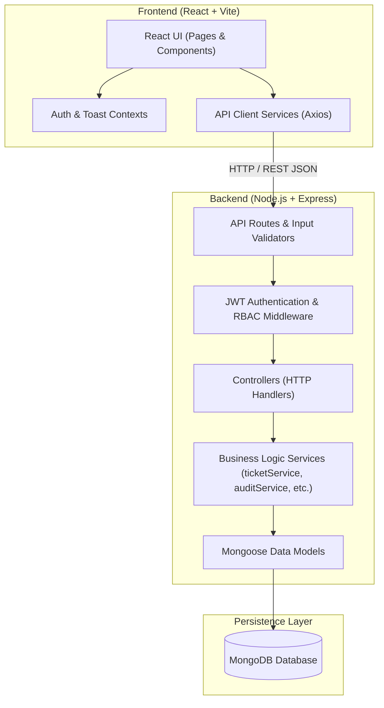
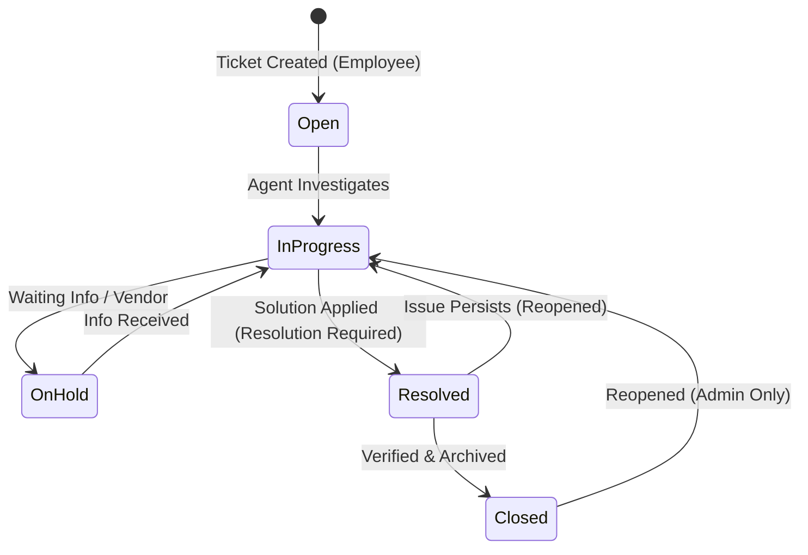

# ServiceFlow – Full-Stack IT Service & Incident Management Platform

ServiceFlow is an enterprise-grade IT Service Management (ITSM) and Incident Management platform engineered for modern organizations. It streamlines the lifecycle of enterprise IT support tickets—from initial report and triage to assignment, communication, SLA monitoring, and final resolution.

Built with a modular **Express/Node.js** architecture, **MongoDB/Mongoose** data persistence, and a responsive **React/Vite** frontend, ServiceFlow delivers a clean, scalable incident management experience.

---

## 📌 Problem Statement

In fast-paced corporate environments, IT issues (network outages, hardware breakdowns, access permissions, software license errors) often get lost in email chains or chat messages. This lack of centralized tracking leads to:
- **No visibility** into incident resolution status or team workloads.
- **SLA breaches** without automated escalation or warnings.
- **Unclear ownership**, where critical incidents linger unassigned.
- **Lack of auditability**, leaving compliance and management without historical logs of who modified tickets or when resolutions occurred.

ServiceFlow addresses these bottlenecks by providing structured state transitions, automated SLA deadline computation, in-app notifications, and role-based access control for employees, support specialists, and platform administrators.

---

## 🚀 Key Features

- **Sequential Ticket Tracking**: Generates enterprise-standard human-readable incident numbers (`INC-000001`, `INC-000002`, etc.) using atomic sequence counters.
- **Role-Based Access Control (RBAC)**: Strictly enforced server-side authorization separating **Employee**, **Support Agent**, and **Admin** permissions.
- **Enforced Incident Lifecycle Workflow**: State transition engine preventing invalid updates (e.g., prohibiting uninvestigated closure; requiring documented resolution explanations for resolved tickets).
- **Incident Assignment & Dispatch**: Administrative interface to dispatch or reassign tickets to qualified support specialists.
- **Automated SLA Monitoring**: Computes SLA deadlines based on incident severity (Critical: 4h, High: 8h, Medium: 24h, Low: 72h) with automated overdue detection and visual alerts.
- **Comprehensive Audit Trail**: Real-time logging of all ticket changes (creation, priority adjustments, assignments, status transitions, comments, and resolutions) rendered in a visual activity timeline.
- **Two-Way Incident Collaboration**: Chronological comment stream on incidents between employees and assigned agents.
- **In-App Notification Center**: Unread count badge, real-time alert dropdown, and dedicated notifications inbox.
- **Operational Analytics Dashboards**: Interactive charts powered by Recharts (Status distributions, Priority severity, Category breakdowns, and 7-day volume trends).
- **Server-Side Search, Filter & Pagination**: Multi-criteria querying (Search by ID/Title, Status, Priority, Category, Assignee) with paginated response metadata.
- **Enterprise Design System**: Modern, clean, minimal SaaS aesthetic with status badges, modals, empty states, and responsive layouts.

---

## 🛠 Tech Stack

| Layer | Technologies |
| :--- | :--- |
| **Frontend** | React 18, Vite, React Router v6, Axios, Recharts, Lucide React, Modern CSS3 |
| **Backend** | Node.js, Express.js, express-validator, cookie-parser, morgan, cors |
| **Database** | MongoDB, Mongoose ODM |
| **Security & Auth** | JSON Web Tokens (JWT), bcryptjs password hashing, RBAC middleware |
| **Development** | Concurrently, Git, RESTful API architecture |

---

## 🏛 System Architecture

The project maintains a strict separation of concerns across layers:



---

## 👥 User Roles & Permissions

ServiceFlow implements 3 primary roles with server-side validation:

| Capability | Employee | Support Agent | Administrator |
| :--- | :---: | :---: | :---: |
| Self-Register & Log In | ✅ | ✅ | ✅ |
| Submit New Support Tickets | ✅ | ✅ | ✅ |
| View Own Created Tickets | ✅ | ✅ | ✅ |
| View All Tickets / System Queue | ❌ | ✅ | ✅ |
| Add Comments to Accessible Tickets | ✅ | ✅ | ✅ |
| Update Incident Status | ❌ | ✅ | ✅ |
| Change Incident Priority | ❌ | ✅ | ✅ |
| Assign / Reassign Support Agents | ❌ | ❌ | ✅ |
| Delete Incident Records | ❌ | ❌ | ✅ |
| Access User Management Directory | ❌ | ❌ | ✅ |
| View Operational Analytics & Trends | (Personal) | (Team Workload) | (Enterprise Org) |

---

## 🔄 Ticket Lifecycle & State Machine

Ticket status changes follow a defined state machine:



- Moving to **Resolved** strictly requires providing a `resolutionText` explanation.
- Transitioning directly from **Open** to **Resolved** or **Closed** is rejected by backend business validation.
- Every valid transition automatically logs an `AuditLog` entry and triggers in-app notifications.

---

## 🗄 Database Design

MongoDB collections and relationships managed via Mongoose:

1. **User** (`users`):
   - `name`, `email` (unique), `password` (hashed with bcrypt), `role` (enum: `EMPLOYEE`, `SUPPORT_AGENT`, `ADMIN`), `department`, `isActive`, `timestamps`.
2. **Ticket** (`tickets`):
   - `ticketId` (e.g. `INC-000001`, unique index), `title`, `description`, `category` (enum), `priority` (enum), `status` (enum), `createdBy` (ref: `User`), `assignedTo` (ref: `User`), `resolution` (`{ text, resolvedAt, resolvedBy }`), `slaDeadline`, `isBreached`, `timestamps`.
3. **Comment** (`comments`):
   - `ticketId` (ref: `Ticket`), `userId` (ref: `User`), `text`, `timestamps`.
4. **AuditLog** (`auditlogs`):
   - `ticketId` (ref: `Ticket`), `action` (enum), `performedBy` (ref: `User`), `oldValue`, `newValue`, `metadata`, `timestamps`.
5. **Notification** (`notifications`):
   - `userId` (ref: `User`), `message`, `type`, `relatedTicketId` (ref: `Ticket`), `ticketCode`, `read` (boolean), `timestamps`.
6. **Counter** (`counters`):
   - Atomic sequence counter for human-readable sequential ticket codes.

---

## 📡 REST API Reference

### Authentication (`/api/auth`)
- `POST /api/auth/register` — Register new user account
- `POST /api/auth/login` — Sign in and obtain JWT
- `POST /api/auth/logout` — Clear session
- `GET  /api/auth/me` — Get authenticated user details
- `PATCH /api/auth/me` — Update user profile

### Tickets & Workflow (`/api/tickets`)
- `POST   /api/tickets` — Create a support ticket
- `GET    /api/tickets` — Search, filter, and paginate tickets
- `GET    /api/tickets/:id` — Get ticket details by ID or code (`INC-000001`)
- `PATCH  /api/tickets/:id/status` — Transition status (requires resolution if Resolved)
- `PATCH  /api/tickets/:id/assign` — Assign/reassign agent (Admin only)
- `PATCH  /api/tickets/:id/priority` — Update priority level (Admin/Agent)
- `DELETE /api/tickets/:id` — Delete ticket (Admin only)
- `GET    /api/tickets/:id/history` — Get chronological audit trail
- `POST   /api/tickets/:id/comments` — Post a note/comment on ticket
- `GET    /api/tickets/:id/comments` — Get ticket comments

### Notifications (`/api/notifications`)
- `GET   /api/notifications` — List notifications with pagination
- `GET   /api/notifications/unread-count` — Quick unread count for bell badge
- `PATCH /api/notifications/:id/read` — Mark notification read
- `PATCH /api/notifications/read-all` — Mark all user notifications read

### Dashboard Analytics (`/api/dashboard`)
- `GET /api/dashboard/stats` — KPI metrics summary (Total, Open, In Progress, Critical, Unassigned, Breached)
- `GET /api/dashboard/status` — Breakdown by ticket status
- `GET /api/dashboard/priority` — Breakdown by ticket priority
- `GET /api/dashboard/categories` — Breakdown by service category
- `GET /api/dashboard/trends` — 7-day inflow and resolution trends
- `GET /api/dashboard/recent-activity` — Recent audit events stream (Admin/Agent)

### User Administration (`/api/users`)
- `GET   /api/users` — Directory of users with search and role filter
- `GET   /api/users/:id` — Single user profile (Admin only)
- `PATCH /api/users/:id` — Update user role, department, or active status (Admin only)

---

## ⚙️ Local Setup & Installation

### Prerequisites
- Node.js (v18 or higher recommended)
- MongoDB instance (local or MongoDB Atlas connection string)

### 1. Clone the Repository
```bash
git clone https://github.com/your-username/serviceflow.git
cd serviceflow
```

### 2. Install Dependencies
```bash
# Install root, server, and client dependencies
npm run install:all
```

### 3. Configure Environment Variables
Create a `.env` file in the `server/` directory:
```bash
cp server/.env.example server/.env
```

Review `server/.env`:
```env
PORT=5000
NODE_ENV=development
MONGODB_URI=mongodb://127.0.0.1:27017/serviceflow
JWT_SECRET=your_super_secret_jwt_key_here
CLIENT_URL=http://localhost:5173
```

### 4. Seed the Database
Populate demo users, realistic incidents, comments, notifications, and audit records:
```bash
npm run seed
```

### 5. Run the Application
Start both frontend and backend concurrently:
```bash
npm run dev
```
- Frontend client: `http://localhost:5173`
- Backend API: `http://localhost:5000/api`

---

## 🔑 Demo Credentials (Development Only)

All seed accounts share the development password: **`Password123!`**

| Role | Account Email | Notes |
| :--- | :--- | :--- |
| **Admin** | `admin@serviceflow.local` | Full privilege: assigns agents, deletes tickets, user management, full analytics |
| **Support Agent 1** | `agent1@serviceflow.local` | Tier 2 Support Specialist: triages, updates status, resolves incidents |
| **Support Agent 2** | `agent2@serviceflow.local` | Cloud Ops Agent: investigates network/infrastructure tickets |
| **Employee 1** | `employee1@serviceflow.local` | Sales & Operations employee submitting hardware & email tickets |
| **Employee 2** | `employee2@serviceflow.local` | Engineering employee submitting software & VPN access tickets |

> **Tip:** The login page provides quick one-click autofill buttons for these demo roles.

---

## 📸 Screenshots

*(Placeholders for application screenshots)*
- **Dashboard**: KPI metrics, SLA warnings, and interactive Recharts distribution.
- **Incident Queue**: Multi-criteria search, category tags, SLA countdown badges.
- **Incident Details**: Incident header, problem description, resolution card, visual audit timeline, and chronological comments.
- **User Directory**: Administrative control of user accounts, roles, and access statuses.

---

## 🔮 Future Enhancements

- **Email Gateway Integration**: Ingesting support tickets directly from inbound support mailbox addresses.
- **Single Sign-On (SSO)**: SAML 2.0 / OAuth2 / Okta enterprise identity provider federation.
- **File & Screenshot Attachments**: Direct S3/GCS bucket uploads for crash logs and diagnostic screenshots.
- **Automated Routing Rules**: Auto-assigning incidents based on category keywords and agent shift availability.
