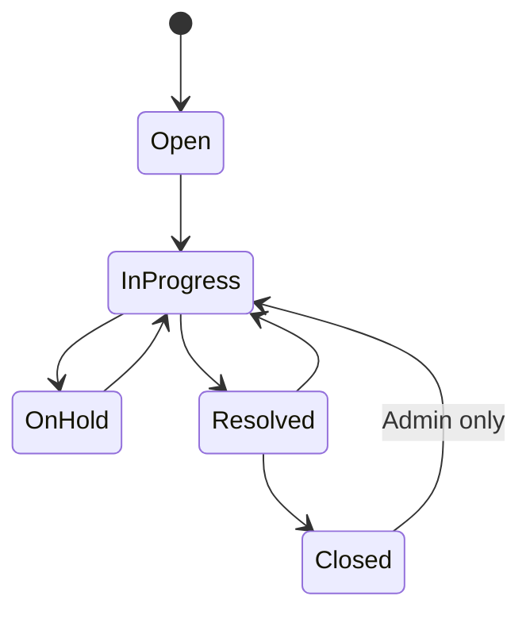
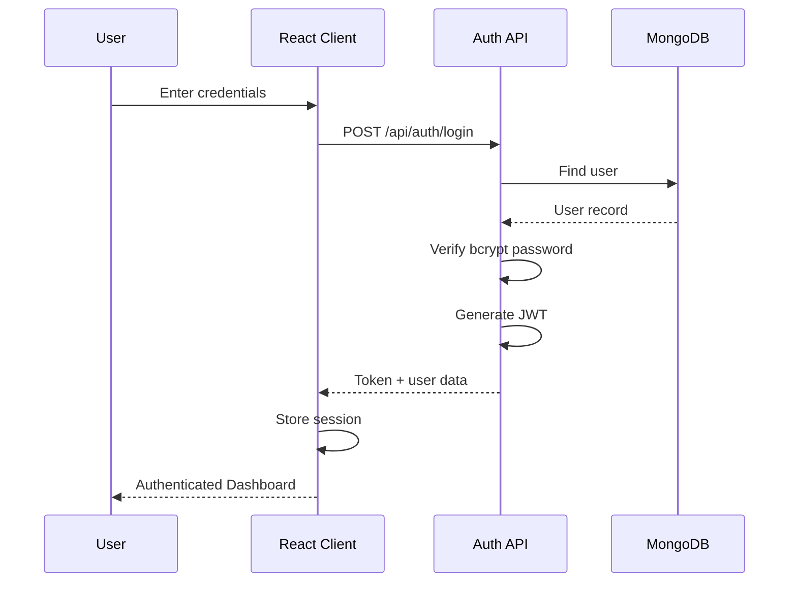
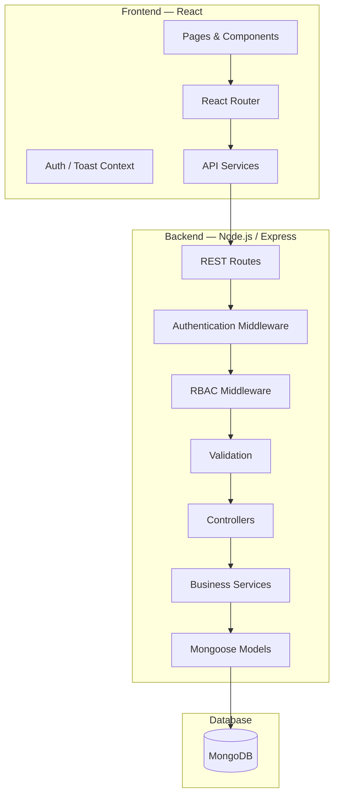
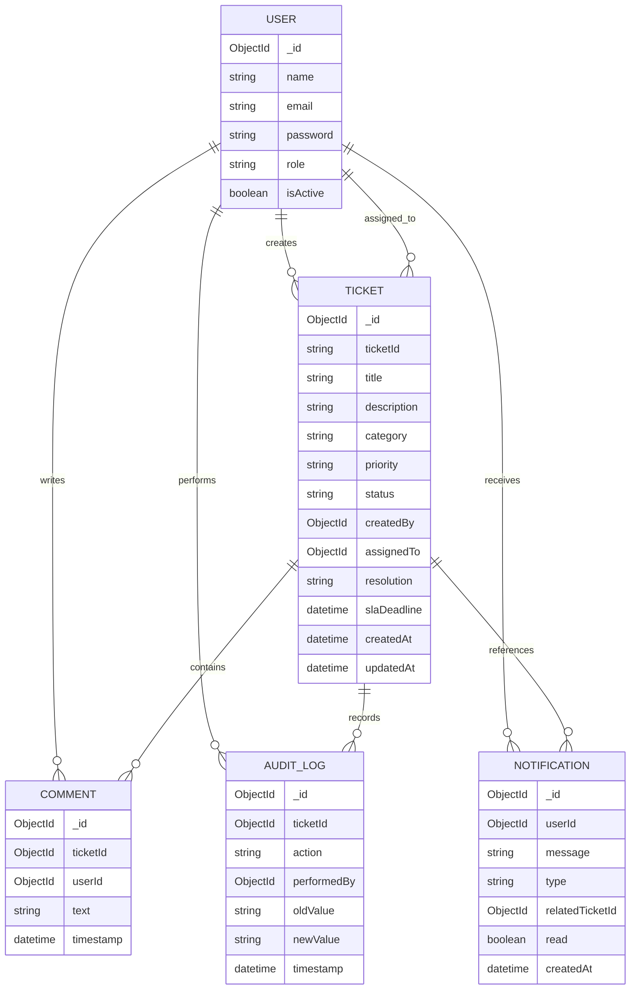
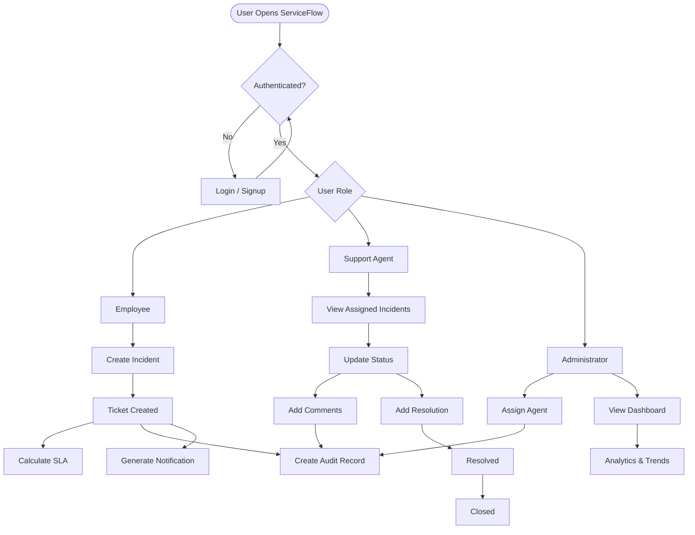
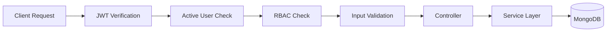

# 🚀 ServiceFlow — Full-Stack IT Service & Incident Management Platform

<p align="center">

**A production-style IT Service Management (ITSM) platform for managing incidents, support workflows, users, SLAs, notifications, audit trails, and operational analytics.**

<br/>

<a href="https://github.com/sai-laghuvar/SERVICE_FLOW-Full-Stack-IT-Service-Incident-Management-Platform">

</a>


</p>

---

## 📌 Table of Contents

* [📖 Project Overview](#-project-overview)
* [🎯 Problem Statement](#-problem-statement)
* [💡 Solution](#-solution)
* [🏢 Real-World Use Case](#-real-world-use-case)
* [✨ Key Features](#-key-features)
* [👥 User Roles](#-user-roles)
* [🎫 Incident Management](#-incident-management)
* [🔄 Ticket Lifecycle](#-ticket-lifecycle)
* [⏱️ SLA Management](#️-sla-management)
* [💬 Collaboration](#-collaboration)
* [🔔 Notification System](#-notification-system)
* [📋 Audit & Activity Tracking](#-audit--activity-tracking)
* [📊 Analytics Dashboard](#-analytics-dashboard)
* [🔎 Search, Filtering & Pagination](#-search-filtering--pagination)
* [🔐 Authentication & Security](#-authentication--security)
* [🏗️ System Architecture](#️-system-architecture)
* [🔄 Request Lifecycle](#-request-lifecycle)
* [🗄️ Database Architecture](#️-database-architecture)
* [🔌 REST API](#-rest-api)
* [🖥️ Frontend Architecture](#️-frontend-architecture)
* [⚙️ Backend Architecture](#️-backend-architecture)
* [📁 Project Structure](#-project-structure)
* [🧰 Technology Stack](#-technology-stack)
* [🧪 Testing & Verification](#-testing--verification)
* [🚀 Getting Started](#-getting-started)
* [🌱 Seed Data](#-seed-data)
* [🔑 Demo Accounts](#-demo-accounts)
* [📸 Screenshots](#-screenshots)
* [🧠 Engineering Highlights](#-engineering-highlights)
* [⚠️ Current Limitations](#️-current-limitations)
* [🔮 Future Enhancements](#-future-enhancements)
* [📚 What I Learned](#-what-i-learned)
* [📄 Resume Description](#-resume-description)
* [👨‍💻 Author](#-author)
* [📜 License](#-license)

---

# 📖 Project Overview

**ServiceFlow** is a full-stack **IT Service Management (ITSM) and Incident Management Platform** designed to simulate how internal IT support teams manage technical incidents in a real organization.

In a typical organization, employees may face problems such as:

* 💻 Laptop or hardware failures
* 🖥️ Software issues
* 🌐 Network connectivity problems
* 🔐 Login and access issues
* 📧 Email problems
* ⚠️ Critical service interruptions

Instead of handling these incidents through scattered emails, messages, spreadsheets, or informal communication, ServiceFlow provides a centralized platform where incidents can be:

> **Reported → Assigned → Investigated → Updated → Resolved → Closed**

The platform provides different interfaces and permissions for:

* 👤 Employees
* 🧑‍💻 Support Agents
* 🛡️ Administrators

It combines **authentication, role-based access control, ticket workflow management, SLA tracking, comments, notifications, audit history, search/filtering, pagination, and operational analytics** into a single application.

---

# 🎯 Problem Statement

Traditional internal IT support processes can become difficult to manage when incidents increase.

A simple support process might look like:

```text
Employee
   │
   │ Reports problem
   ▼
Email / Chat / Phone
   │
   ▼
Support Team
   │
   ├── Who is handling it?
   ├── What is the priority?
   ├── How long has it been open?
   ├── What actions were taken?
   └── Was the issue actually resolved?
```

This creates several problems:

* Lack of centralized incident tracking
* Difficult assignment management
* No consistent incident lifecycle
* Poor visibility into priorities
* Difficult SLA monitoring
* Limited accountability
* Lack of historical activity
* Difficult operational reporting
* No centralized notification system

---

# 💡 Solution

ServiceFlow addresses these problems through a centralized ITSM platform.

```text
                    ┌──────────────────────┐
                    │      Employee        │
                    │  Reports Incident    │
                    └──────────┬───────────┘
                               │
                               ▼
                    ┌──────────────────────┐
                    │       ServiceFlow    │
                    │    Incident System   │
                    └──────────┬───────────┘
                               │
              ┌────────────────┼────────────────┐
              │                │                │
              ▼                ▼                ▼
        Assignment         SLA Tracking     Notifications
              │                │                │
              └────────────────┼────────────────┘
                               ▼
                    ┌──────────────────────┐
                    │    Support Agent     │
                    │ Investigate & Resolve │
                    └──────────┬───────────┘
                               │
                               ▼
                    ┌──────────────────────┐
                    │      Resolution      │
                    └──────────┬───────────┘
                               │
                               ▼
                    ┌──────────────────────┐
                    │       Closed         │
                    └──────────────────────┘
```

The result is a structured workflow where every incident has:

* A unique ticket ID
* Reporter
* Assigned support agent
* Category
* Priority
* Current status
* SLA deadline
* Comments
* Resolution
* Activity history
* Notifications
* Audit records

---

# 🏢 Real-World Use Case

ServiceFlow is designed around an internal IT support scenario.

### Example

An employee's laptop suddenly stops connecting to the company's network.

The employee creates:

```text
Ticket ID: INC-000042

Title:
Laptop cannot connect to corporate Wi-Fi

Category:
Network

Priority:
High

Status:
Open
```

The administrator assigns the incident to a support agent.

The agent receives a notification and begins investigating.

```text
Open
  ↓
In Progress
  ↓
On Hold
  ↓
In Progress
  ↓
Resolved
  ↓
Closed
```

Every important action is recorded in the system.

This provides both **operational visibility** and **accountability**.

---

# ✨ Key Features

| Feature                | Description                                             |
| ---------------------- | ------------------------------------------------------- |
| 🔐 Authentication      | Secure registration and login                           |
| 👥 RBAC                | Employee, Support Agent and Admin roles                 |
| 🎫 Incident Management | Create and manage IT incidents                          |
| 🔄 Workflow Engine     | Controlled ticket state transitions                     |
| 🎯 Assignment          | Assign incidents to support agents                      |
| 🚨 Priority Management | Low, Medium, High and Critical                          |
| 🏷️ Categorization     | Hardware, Software, Network, Access/Login, Email, Other |
| ⏱️ SLA Management      | Priority-based response deadlines                       |
| 💬 Comments            | Collaboration between users and support agents          |
| 📋 Audit Logs          | Track important ticket changes                          |
| 🔔 Notifications       | In-app notifications and unread tracking                |
| 📊 Dashboard           | Operational metrics and charts                          |
| 🔎 Search              | Search tickets by ID/title                              |
| 🎛️ Filtering          | Filter by status, priority, category, agent and date    |
| 📄 Pagination          | Server-side pagination                                  |
| 👤 User Management     | Administrative user management                          |
| 📈 Analytics           | Status, priority, category and trend analytics          |
| 🧪 API Testing         | Automated backend verification                          |
| 🌱 Seed Data           | Demo users and realistic incidents                      |

---

# 👥 User Roles

ServiceFlow uses **Role-Based Access Control (RBAC)**.

There are three primary roles.

## 👤 Employee

Employees are responsible for reporting and tracking their own incidents.

### Capabilities

* Create incidents
* View their incidents
* Track ticket status
* Track assigned support agent
* View priority
* Add comments
* View notifications
* View profile

Employees cannot access administrative functionality.

---

## 🧑‍💻 Support Agent

Support agents are responsible for investigating and resolving incidents.

### Capabilities

* View assigned/team incidents
* Update ticket status
* Update priority
* Add comments
* Add resolution
* Resolve incidents
* Track SLA information
* View ticket history
* Receive assignment notifications

Support agents cannot perform unrestricted administrative operations.

---

## 🛡️ Administrator

Administrators have system-level control.

### Capabilities

* View all incidents
* Assign/reassign tickets
* Manage users
* Manage ticket priorities
* Monitor SLA performance
* View operational analytics
* Access audit information
* Reopen incidents where permitted
* Monitor overall support operations

---

# 🎫 Incident Management

The incident is the central entity in ServiceFlow.

Each ticket contains information such as:

```text
Ticket
├── Ticket ID
├── Title
├── Description
├── Category
├── Priority
├── Status
├── Created By
├── Assigned To
├── SLA Deadline
├── Resolution
├── Created At
└── Updated At
```

### Supported Categories

* 💻 Hardware
* 🧩 Software
* 🌐 Network
* 🔐 Access/Login
* 📧 Email
* 🛠️ Other

### Supported Priorities

| Priority    | Meaning                  |
| ----------- | ------------------------ |
| 🟢 Low      | Minor issue              |
| 🟡 Medium   | Normal operational issue |
| 🟠 High     | Significant impact       |
| 🔴 Critical | Major/urgent incident    |

---

# 🔄 Ticket Lifecycle

ServiceFlow does not allow users to arbitrarily change a ticket from one status to another.

Instead, a **workflow state machine** controls valid transitions.



### Resolution Requirement

A ticket cannot be moved to `Resolved` without providing a resolution.

For example:

```text
Status:
In Progress

Resolution:
Reinstalled the network adapter driver and
verified connectivity with the corporate network.

↓

Status:
Resolved
```

This prevents tickets from being marked as resolved without an explanation.

---

# ⏱️ SLA Management

ServiceFlow includes automated **Service Level Agreement (SLA)** calculation based on ticket priority.

| Priority    |      SLA |
| ----------- | -------: |
| 🔴 Critical |  4 hours |
| 🟠 High     |  8 hours |
| 🟡 Medium   | 24 hours |
| 🟢 Low      | 72 hours |

When a ticket is created, the system calculates its SLA deadline.

```text
Ticket Created
      │
      ▼
Determine Priority
      │
      ▼
Calculate SLA Duration
      │
      ▼
Generate Deadline
      │
      ▼
Monitor Ticket
      │
      ├── Within SLA
      │
      ├── Approaching Deadline
      │
      └── SLA Breached
```

The dashboard can expose SLA-related operational information such as:

* SLA compliance
* Breached incidents
* Overdue tickets
* Priority distribution

---

# 💬 Collaboration

ServiceFlow provides ticket-level comments so users and support agents can communicate around a specific incident.

Example:

```text
Employee:
"My laptop cannot connect to Wi-Fi."

Support Agent:
"Checking the network adapter configuration."

Employee:
"The issue started after yesterday's update."

Support Agent:
"Driver rollback completed. Please verify connectivity."

Employee:
"Confirmed. Wi-Fi is working."
```

Each comment contains:

```text
Ticket ID
User ID
Comment
Timestamp
```

This keeps incident communication connected to the actual ticket.

---

# 🔔 Notification System

ServiceFlow provides an in-app notification system.

Notifications can be generated for events such as:

* Ticket assignment
* Ticket status changes
* New comments
* Ticket resolution
* Ticket closure

Example:

```text
🔔 Notifications

New ticket assigned
INC-000042 has been assigned to you.

Status updated
INC-000042 moved to In Progress.

New comment
A new comment was added to INC-000042.

Ticket resolved
INC-000042 has been resolved.
```

The notification system supports:

* Unread count
* Notification list
* Mark individual notification as read
* Mark all notifications as read
* Related ticket reference

> Notifications currently use application refresh/action handling and periodic polling rather than WebSockets.

---

# 📋 Audit & Activity Tracking

Important ticket actions are recorded in an audit log.

Examples include:

* Ticket created
* Ticket assigned
* Priority changed
* Status changed
* Comment added
* Resolution added
* Ticket resolved
* Ticket closed

Example activity timeline:

```text
09:15  Ticket created
       Employee: INC-000042

09:18  Assigned to
       Support Agent: agent1

09:26  Status changed
       Open → In Progress

09:42  Comment added

10:15  Resolution added

10:16  Status changed
       In Progress → Resolved

10:45  Ticket closed
```

This provides a historical record of how an incident was handled.

---

# 📊 Analytics Dashboard

The administrative dashboard provides a centralized view of support operations.

### KPI Metrics

```text
┌───────────────┐
│ Total Tickets │
│      42       │
└───────────────┘

┌───────────────┐
│ Open Tickets  │
│      12       │
└───────────────┘

┌───────────────┐
│ In Progress   │
│       8       │
└───────────────┘

┌───────────────┐
│ Critical      │
│       3       │
└───────────────┘
```

### Analytics

The backend generates aggregated information for:

* Ticket status
* Ticket priority
* Ticket category
* Seven-day ticket trends
* Recent activity

The frontend visualizes these metrics using **Recharts**.

---

# 📈 Dashboard Data Flow


The dashboard is therefore not based on hardcoded frontend numbers.

---

# 🔎 Search, Filtering & Pagination

The incident queue supports server-side querying.

### Search

Users can search using:

* Ticket ID
* Ticket title

Example:

```text
Search:
INC-000042
```

### Filters

Tickets can be filtered by:

* Status
* Priority
* Category
* Assigned agent
* Date

### Pagination

Large datasets are handled using server-side pagination.

Example API response structure:

```json
{
  "tickets": [],
  "pagination": {
    "page": 1,
    "limit": 10,
    "total": 42,
    "pages": 5
  }
}
```

This avoids loading the entire ticket dataset into the browser.

---

# 🔐 Authentication & Security

Security is implemented across both frontend and backend.

## Authentication

ServiceFlow uses:

* JWT authentication
* bcrypt password hashing
* Protected routes
* Token verification
* Active-user verification
* Logout handling

Passwords are **never stored as plaintext**.

---

## Authentication Flow



---

## Protected Request

```text
React Application
       │
       │ Authorization: Bearer <JWT>
       ▼
Express API
       │
       ▼
JWT Middleware
       │
       ├── Invalid → 401
       │
       └── Valid
             │
             ▼
        Active User
             │
             ▼
        RBAC Check
             │
             ▼
       Controller
             │
             ▼
        Service Layer
             │
             ▼
          MongoDB
```

---

# 🏗️ System Architecture

ServiceFlow follows a layered full-stack architecture.



---

# 🔄 Request Lifecycle

A typical ticket request flows through multiple layers.

```text
1. React UI
      ↓
2. Axios API Service
      ↓
3. Express Route
      ↓
4. JWT Authentication
      ↓
5. RBAC Authorization
      ↓
6. Request Validation
      ↓
7. Controller
      ↓
8. Ticket Service
      ↓
9. Mongoose Model
      ↓
10. MongoDB
      ↓
11. Response
      ↓
12. React UI Update
```

This separation keeps business logic away from the route definitions and UI.

---

# 🗄️ Database Architecture

MongoDB is used as the primary database.

## Collections

```text
MongoDB
│
├── users
│
├── tickets
│
├── comments
│
├── notifications
│
├── auditLogs
│
└── counters
```

---

# 🧩 Entity Relationship Overview



---

# 🔌 REST API

ServiceFlow exposes RESTful APIs through Express.

## 🔐 Authentication

| Method | Endpoint             | Purpose          |
| ------ | -------------------- | ---------------- |
| POST   | `/api/auth/register` | Register user    |
| POST   | `/api/auth/login`    | Login            |
| POST   | `/api/auth/logout`   | Logout           |
| GET    | `/api/auth/me`       | Get current user |
| PATCH  | `/api/auth/me`       | Update profile   |

---

## 🎫 Tickets

| Method | Endpoint                    | Purpose                    |
| ------ | --------------------------- | -------------------------- |
| POST   | `/api/tickets`              | Create ticket              |
| GET    | `/api/tickets`              | List/search/filter tickets |
| GET    | `/api/tickets/:id`          | Get ticket                 |
| PATCH  | `/api/tickets/:id/status`   | Change status              |
| PATCH  | `/api/tickets/:id/assign`   | Assign ticket              |
| PATCH  | `/api/tickets/:id/priority` | Change priority            |
| DELETE | `/api/tickets/:id`          | Delete ticket              |
| GET    | `/api/tickets/:id/history`  | Get audit history          |
| POST   | `/api/tickets/:id/comments` | Add comment                |
| GET    | `/api/tickets/:id/comments` | Get comments               |

---

## 📊 Dashboard

| Method | Endpoint                         | Purpose               |
| ------ | -------------------------------- | --------------------- |
| GET    | `/api/dashboard/stats`           | KPI statistics        |
| GET    | `/api/dashboard/status`          | Status distribution   |
| GET    | `/api/dashboard/priority`        | Priority distribution |
| GET    | `/api/dashboard/categories`      | Category distribution |
| GET    | `/api/dashboard/trends`          | Ticket trends         |
| GET    | `/api/dashboard/recent-activity` | Recent activity       |

---

## 🔔 Notifications

| Method | Endpoint                          | Purpose                |
| ------ | --------------------------------- | ---------------------- |
| GET    | `/api/notifications`              | Get notifications      |
| GET    | `/api/notifications/unread-count` | Get unread count       |
| PATCH  | `/api/notifications/:id/read`     | Mark notification read |
| PATCH  | `/api/notifications/read-all`     | Mark all as read       |

---

## 👥 Users

| Method | Endpoint         | Purpose     |
| ------ | ---------------- | ----------- |
| GET    | `/api/users`     | List users  |
| GET    | `/api/users/:id` | Get user    |
| PATCH  | `/api/users/:id` | Update user |

---

## ❤️ Health Check

```http
GET /api/health
```

Used to verify that the backend API is running.

---

# 🖥️ Frontend Architecture

The frontend is built using **React 18 + React Router + Axios + Recharts**.

### Main pages

```text
Login
Signup
Dashboard
Tickets
Create Ticket
Ticket Details
Users Management
Notifications
Profile
Not Found
```

### Reusable components

```text
ProtectedRoute
RoleRoute
LoadingSpinner
TicketStatusBadge
PriorityBadge
EmptyState
ErrorMessage
Pagination
TicketFilters
TicketTable
DashboardCard
NotificationBell
ActivityTimeline
CommentSection
Modal
AssignAgentModal
ChangeStatusModal
Sidebar
Navbar
AppLayout
```

This component-based structure reduces duplication and keeps the UI maintainable.

---

# ⚙️ Backend Architecture

The backend follows a layered structure:

```text
Routes
   ↓
Middleware
   ↓
Controllers
   ↓
Services
   ↓
Models
   ↓
MongoDB
```

### Why this architecture?

Instead of putting all logic inside route handlers:

```javascript
app.post("/tickets", async (req, res) => {
    // everything here
});
```

the application separates responsibilities.

### Routes

Responsible for defining API endpoints.

### Middleware

Responsible for:

* Authentication
* Authorization
* Validation
* Error handling

### Controllers

Responsible for handling HTTP requests and responses.

### Services

Responsible for business logic such as:

* Ticket workflow
* SLA calculations
* Notifications
* Audit logging
* Dashboard aggregation

### Models

Responsible for MongoDB data structures through Mongoose.

---

# 📁 Project Structure

```text
SERVICE_FLOW/
│
├── client/
│   │
│   ├── src/
│   │   ├── components/
│   │   ├── pages/
│   │   ├── layouts/
│   │   ├── services/
│   │   ├── context/
│   │   ├── hooks/
│   │   ├── utils/
│   │   ├── App.jsx
│   │   └── main.jsx
│   │
│   ├── package.json
│   └── vite.config.js
│
├── server/
│   │
│   ├── config/
│   ├── controllers/
│   ├── middleware/
│   ├── models/
│   ├── routes/
│   ├── services/
│   ├── seed/
│   ├── test/
│   │   └── apiTest.js
│   ├── app.js
│   ├── server.js
│   └── seed.js
│
├── .env.example
├── .gitignore
├── package.json
└── README.md
```

---

# 🧰 Technology Stack

## Frontend

* React 18
* React Router
* Axios
* Vite
* Recharts
* Lucide React
* CSS3

## Backend

* Node.js
* Express.js
* JavaScript / ES6+
* Mongoose
* JWT
* bcryptjs
* express-validator
* cookie-parser
* CORS

## Database

* MongoDB
* MongoDB Atlas compatible

## Development

* Git
* GitHub
* VS Code
* Postman / API testing

---

# 🧪 Testing & Verification

The backend includes an automated API verification suite covering the main application workflows.

The implemented verification covers:

```text
✓ Health endpoint
✓ Unauthorized access rejection
✓ Admin authentication
✓ Support agent authentication
✓ Employee authentication
✓ RBAC protection
✓ User management
✓ Ticket creation
✓ Ticket assignment
✓ Valid status transition
✓ Invalid status transition rejection
✓ Employee comments
✓ Agent comments
✓ Resolution validation
✓ Audit history
✓ Notifications
✓ Dashboard aggregation
✓ Ticket trends
✓ Search
✓ Pagination
```

### Verification Result

```text
20 tests passed
0 tests failed
```

The frontend production build was also verified successfully.

---

# 🚀 Getting Started

## 1️⃣ Clone the repository

```bash
git clone https://github.com/sai-laghuvar/SERVICE_FLOW-Full-Stack-IT-Service-Incident-Management-Platform.git

cd SERVICE_FLOW-Full-Stack-IT-Service-Incident-Management-Platform
```

---

## 2️⃣ Install dependencies

Install root dependencies:

```bash
npm install
```

Install frontend dependencies:

```bash
cd client
npm install
cd ..
```

Install backend dependencies:

```bash
cd server
npm install
cd ..
```

---

## 3️⃣ Configure environment variables

Create:

```text
server/.env
```

Example:

```env
PORT=5000

MONGO_URI=mongodb://127.0.0.1:27017/serviceflow

JWT_SECRET=your_secure_jwt_secret

CLIENT_URL=http://localhost:5173
```

> Never commit real credentials or secrets to GitHub.

---

# ▶️ Running the Application

### Run both frontend and backend

From the project root:

```bash
npm run dev
```

### Or run separately

Backend:

```bash
npm run dev:server
```

Frontend:

```bash
npm run dev:client
```

The application runs on:

```text
Frontend:
http://localhost:5173

Backend:
http://localhost:5000
```

---

# 🌱 Seed Data

ServiceFlow includes seed data for quickly demonstrating the platform.

Run:

```bash
npm run seed
```

The seed process creates:

* Demo users
* Support agents
* Employees
* Example incidents
* Comments
* Audit records
* Notifications

This makes it possible to explore the application without manually creating every record.

---

# 🔑 Demo Accounts

All demo accounts use:

```text
Password123!
```

### Administrator

```text
admin@serviceflow.local
```

### Support Agents

```text
agent1@serviceflow.local
agent2@serviceflow.local
```

### Employees

```text
employee1@serviceflow.local
employee2@serviceflow.local
```

> These credentials are intended only for local/demo usage.

---

# 📸 Screenshots

Add application screenshots here after running the project.

Recommended screenshots:

### 🔐 Login

```text
docs/screenshots/login.png
```

### 📊 Dashboard

```text
docs/screenshots/dashboard.png
```

### 🎫 Ticket Queue

```text
docs/screenshots/tickets.png
```

### 🎫 Ticket Details

```text
docs/screenshots/ticket-details.png
```

### 👥 User Management

```text
docs/screenshots/users.png
```

### 🔔 Notifications

```text
docs/screenshots/notifications.png
```

### 📋 Activity Timeline

```text
docs/screenshots/activity.png
```

Example Markdown:

```markdown
## Dashboard


## Ticket Management


## Ticket Details


```

---

# 🧠 Engineering Highlights

ServiceFlow was designed to demonstrate more than basic CRUD operations.

## 1. Workflow State Machine

Ticket statuses are controlled through explicit transition rules.

```text
Open
 ↓
In Progress
 ├── On Hold
 │      ↓
 │  In Progress
 │
 └── Resolved
        ↓
      Closed
```

Invalid transitions are rejected by the backend.

---

## 2. Business Logic Separation

Business logic is placed inside service modules rather than directly inside Express routes.

```text
Route
 ↓
Controller
 ↓
Service
 ↓
Model
 ↓
Database
```

This makes the backend easier to extend and maintain.

---

## 3. Atomic Ticket Number Generation

Tickets receive sequential identifiers such as:

```text
INC-000001
INC-000002
INC-000003
...
```

A counter mechanism is used to generate unique ticket numbers.

---

## 4. Server-Side Querying

Search, filtering and pagination are handled by the backend rather than downloading the entire dataset to the browser.

This makes the architecture more suitable for larger datasets.

---

## 5. Auditability

Important ticket changes are recorded as audit events.

This allows the system to answer:

```text
Who changed it?
What changed?
What was the previous value?
What is the new value?
When did it happen?
```

---

## 6. Role-Based Authorization

Authorization is enforced at the API level.

The frontend may hide UI controls, but the backend still validates the user's permissions.

This prevents users from bypassing restrictions simply by directly calling an API endpoint.

---

## 7. SLA Calculation

SLA deadlines are automatically calculated from ticket priority.

```text
Priority
   ↓
SLA Rule
   ↓
Deadline
   ↓
Current Time
   ↓
SLA State
```

---

## 8. Dashboard Aggregation

Dashboard statistics are generated from database aggregation operations rather than hardcoded values.

This allows the dashboard to reflect the underlying ticket data.

---

# 🔄 Complete Project Flow

The complete ServiceFlow workflow can be summarized as:



---

# 🔐 Security Flow



Every protected request passes through the backend authorization pipeline.

---

# ⚠️ Current Limitations

The project intentionally focuses on core ITSM functionality.

### Current limitations include:

#### 1. Notification Transport

Notifications are implemented as in-app notifications with refresh/action handling and periodic polling.

Real-time WebSocket communication is not currently implemented.

#### 2. Database Persistence

The application supports MongoDB persistence through a configured MongoDB URI.

A development fallback can use an in-memory MongoDB instance, which means data can reset when the server process stops.

#### 3. External Integrations

The current implementation does not include:

* Email notifications
* SMS
* WhatsApp
* Slack
* Microsoft Teams
* SSO/SAML
* Okta integration

#### 4. Cloud Deployment

The project is currently designed to run locally and is not presented as a production cloud deployment.

---

# 🔮 Future Enhancements

Potential future improvements include:

### 🔔 Real-Time Communication

* Socket.IO
* WebSocket-based notifications
* Live ticket updates

### 📧 External Notifications

* Email notifications
* Slack integration
* Microsoft Teams integration

### 🔐 Enterprise Authentication

* Google OAuth
* Microsoft OAuth
* SSO
* SAML
* Okta

### 📊 Advanced Analytics

* SLA compliance trends
* Agent performance metrics
* Mean Time to Resolution
* Mean Time to Response
* Incident volume forecasting

### 🧠 Intelligent ITSM

Potential future AI functionality:

* Automatic ticket categorization
* Priority recommendation
* Duplicate incident detection
* Suggested troubleshooting steps
* Resolution recommendation
* Knowledge-base search

### ☁️ Deployment

Potential deployment architecture:

```text
React
  ↓
CDN / Static Hosting
  ↓
Node.js API
  ↓
Cloud Infrastructure
  ↓
MongoDB Atlas
```

---

# 📚 What I Learned

Building ServiceFlow involved practical experience with:

### Frontend Development

* React component architecture
* React Router
* Protected routes
* Context API
* API integration
* State management
* Reusable UI components
* Dashboard visualization
* Form validation

### Backend Development

* Express.js
* REST API design
* Middleware
* Controllers
* Service-layer architecture
* Authentication
* Authorization
* Validation
* Error handling

### Database

* MongoDB
* Mongoose
* Data modeling
* Relationships through references
* Aggregation pipelines
* Pagination
* Query filtering

### Security

* JWT authentication
* bcrypt password hashing
* Role-based authorization
* Protected API routes
* Environment variables

### Software Engineering

* Layered architecture
* State-machine based workflows
* Audit logging
* SLA logic
* API testing
* Seed data
* Git/GitHub project organization

---

# 💼 Why This Project Is Interview-Worthy

ServiceFlow demonstrates several concepts that are important in real-world software engineering:

```text
                    SERVICEFLOW
                         │
        ┌────────────────┼────────────────┐
        │                │                │
        ▼                ▼                ▼
    Frontend          Backend         Database
        │                │                │
      React           Express         MongoDB
        │                │                │
        └────────────────┼────────────────┘
                         │
                         ▼
                Business Logic
                         │
        ┌────────────────┼────────────────┐
        │                │                │
        ▼                ▼                ▼
      RBAC          SLA Engine       Workflow
        │                │                │
        └────────────────┼────────────────┘
                         │
                         ▼
                Audit & Analytics
```

The project goes beyond simple:

```text
Create → Read → Update → Delete
```

and introduces:

* Authentication
* Authorization
* Business rules
* Workflow validation
* SLA calculations
* Auditability
* Notifications
* Aggregation
* Server-side querying
* Role-specific behavior
* Layered architecture

---

# 📄 Resume Description

### ServiceFlow — Full-Stack IT Service & Incident Management Platform

**Tech Stack:** React, Node.js, Express.js, MongoDB, Mongoose, JWT, bcrypt, Recharts

* Developed a full-stack IT service management platform using **React, Node.js, Express.js and MongoDB** with role-based workflows for Employees, Support Agents and Administrators.
* Implemented **JWT authentication, bcrypt password hashing and RBAC**, along with controlled ticket state transitions and mandatory resolution validation.
* Built priority-based **SLA tracking, audit logging, in-app notifications, server-side search/filtering/pagination and MongoDB aggregation dashboards** for operational monitoring.

---

# 📌 Project Summary

ServiceFlow is a full-stack ITSM platform that centralizes the complete incident management lifecycle.

```text
                 ┌─────────────────────┐
                 │      Employee       │
                 └──────────┬──────────┘
                            │
                            ▼
                    ┌───────────────┐
                    │ Create Ticket │
                    └───────┬───────┘
                            │
                            ▼
                    ┌───────────────┐
                    │    Assign     │
                    └───────┬───────┘
                            │
                            ▼
                    ┌───────────────┐
                    │ Investigation │
                    └───────┬───────┘
                            │
                            ▼
                    ┌───────────────┐
                    │   Resolution  │
                    └───────┬───────┘
                            │
                            ▼
                    ┌───────────────┐
                    │     Close     │
                    └───────────────┘
```

At every stage, ServiceFlow provides:

**Security → Workflow → SLA → Collaboration → Notifications → Auditability → Analytics**

---

# 👨‍💻 Author

### Sai Laghuvar

B.Tech — Computer Science & Engineering (IoT)

Interested in:

* Full-Stack Development
* Backend Engineering
* IoT
* Machine Learning
* Cloud Computing
* Software Engineering

---

# 🔗 Repository

**GitHub Repository**

https://github.com/sai-laghuvar/SERVICE_FLOW-Full-Stack-IT-Service-Incident-Management-Platform

---

# 📜 License

This project is licensed under the **MIT License**.

---

<p align="center">

### 🚀 ServiceFlow

**Report. Assign. Resolve. Track.**

Built as a full-stack software engineering project to demonstrate real-world IT service management concepts.

</p>
